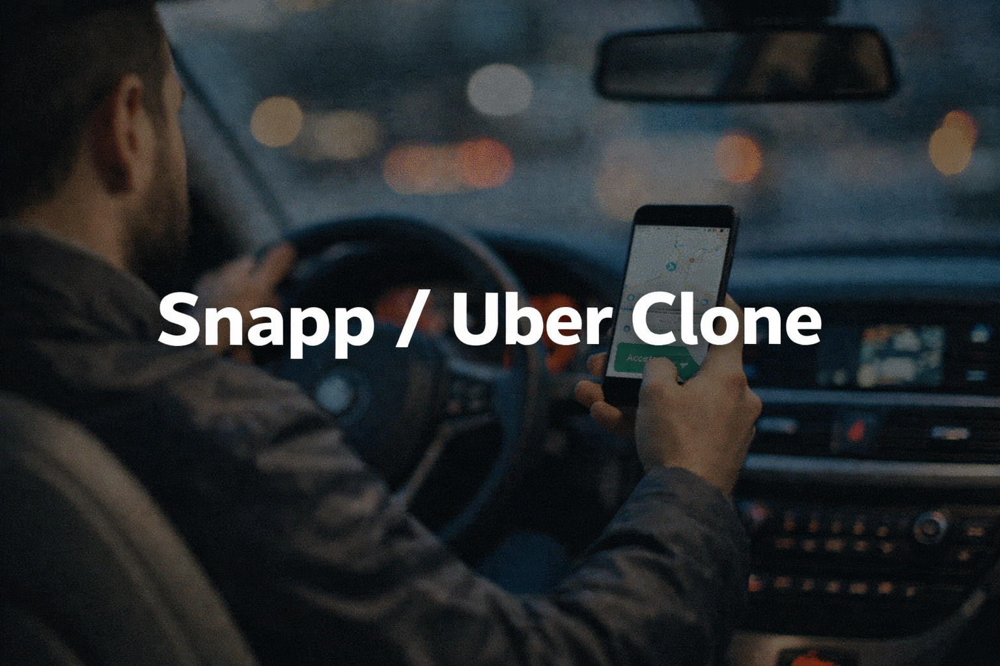
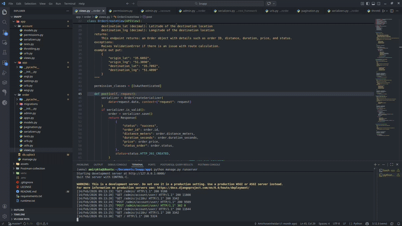
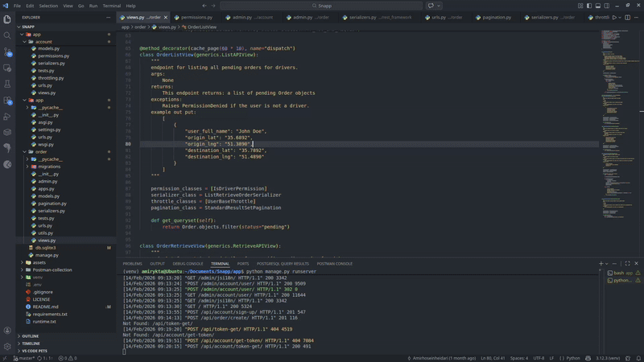

# Snapp / Uber Clone

<p align="center">
  
</p>


## Project Overview

This project is a **Snapp / Uber Clone** built for educational and architectural practice purposes. The goal is to simulate the core functionality of a ride-hailing platform with a clear separation of concerns, scalable design, and role-based access control.

> Disclaimer: This project is for learning purposes only and has no commercial or official affiliation with Snapp or Uber.

---

## Architecture Overview

The system is designed using a **multi-app Django architecture** and consists of two main applications:

* **account**: Handles authentication, authorization, and user role management
* **order**: Handles ride requests, trip lifecycle, and order-related logic

Authentication is implemented using **JWT (JSON Web Tokens)**, and token handling is integrated via **OpenRouter Services**.

The backend is built with **Django 6**.

---

## User Roles

The platform supports two distinct roles:

* **User (Passenger)**
* **Driver**

Role separation is enforced at both the **authentication** and **business logic** levels to ensure clean access control and predictable behavior across the system.

---
<figure align="center">
  
  <figcaption>Test User Account creating and Creating an Order endpoints</figcaption>
</figure>


## Features

### Passenger (User)

* Register and login using JWT authentication
* Request a ride by submitting origin and destination
* View ride status (pending, accepted, in progress, completed)
* View personal ride history

### Driver

* Register and authenticate as a driver
* Toggle availability (online / offline)
* Receive ride requests
* Accept or reject ride requests
* Complete trips
* View trip and earnings history

---

## Authentication & Security

* JWT-based authentication
* Role-based access control (User / Driver)
* Token management handled via OpenRouter Services
* Secure endpoint separation per role

---

## Tech Stack

* **Backend**: Django 6
* **Authentication**: JWT (JSON WEB TOKEN)
* **Authorization**: Role-based access control (User / Driver)
* **Architecture**: Modular Django apps (accounts, orders)
* **Database**: PostgreSQL (recommended), SQLite (development)
* **Well-documented**: Google-style documentation and DocString
* **API Style**: REST

---

<figure align="center">
  
  <figcaption>Test User Account creating and Creating an Order endpoints</figcaption>
</figure>


## API Endpoints (Sample)

### Authentication (accounts)

| Method | Endpoint            | Description             | Role          |
| ------ | ------------------- | ----------------------- | ------------- |
| POST   | /api/sign-up/       | Register user or driver | Public        |
| POST   | /api/login/         | Login and receive JWT   | Public        |
| GET    | /api/you/           | Get user profile        | User / Driver |
| GET    | /api/you/edit/      | Edit user profile       | User / Driver |
| GET    | /api/verify-token/  | Check user token        | User / Driver |
| GET    | /api/refresh-token/ | Get token for user      | User / Driver |

### Orders / Trips (orders)

| Method | Endpoint                   | Description           | Role   |
| ------ | -------------------------- | --------------------- | ------ |
| POST   | /api/orders/create/        | Create ride request   | User   |
| GET    | /api/orders/               | List drivers requests | Driver |
| POST   | /api/orders/{id}/          | Get a ride            | Driver |
| POST   | /api/orders/{id}/accept/   | Accept ride           | Driver |
| POST   | /api/order/{id}/status/... | Start trip            | Driver |

---

## 📦 API Example – Create Order

### Endpoint

```
POST /api/order/create/
```

### Authentication

* JWT Bearer Token required
* Role: User (Passenger)

### Request Body

```json
{
  "origin_lat": "35.6892",
  "origin_lng": "51.3890",
  "destination_lat": "35.7892",
  "destination_lng": "51.4890"
}
```

### Successful Response (201 Created)

```json
{
  "status": "success",
  "order_id": 42,
  "distance_meters": 12500,
  "duration_seconds": 940,
  "price": 98000,
  "status_order": "pending"
}
```

### Possible Errors

| Status Code | Reason                                  |
| ----------- | --------------------------------------- |
| 400         | Validation error or invalid coordinates |
| 401         | Unauthorized (missing or invalid token) |
| 403         | Forbidden (role is not User)            |

---

## Project Structure (Simplified)

```
project-root/
│
├── account/
│   ├── models.py
│   ├── serializers.py
│   ├── permissions.py
│   ├── throttling.py
│   ├── urls.py
│   └── views.py
│
├── order/
│   ├── models.py
│   ├── serializers.py
│   ├── pagination.py
│   ├── utils.py
│   ├── urls.py
│   └── views.py
│
├── app/            # Django settings & config
├── manage.py
├── requirements.txt
├── LICENSE
└── README.md
```

---

## Notes

* This project focuses on backend logic and system design rather than UI/UX.
* The codebase is structured to allow future expansion.

---

## Future Improvements

* Pricing and distance calculation service
* Caching system for list of orders
* Using SQLite for development and PostgreSQL for production
* Rate limiting and monitoring

---

## Author

* **GitHub**: [amir-hash19](https://amir-hash19.github.io/)
* **Email**: [amirhosein.hydri1381@gmail.com](mailto:amirhosein.hydri1381@gmail.com)

Made with ❤️ by Amir
